Data Science Exam: Solution Overview
================
2025-06-17

This ReadMe summarizes my replies to the five questions of the Data
Science 48h exam 2025. In order to not overload this report, complete
data wrangling and calculations can be found in the ReadMe files of the
respective tasks folders.

# Preparations

## Loading Necessary Packages

To make sure that the ReadMe runs, the following, neccessary packages
need to be loaded.

``` r
library(tidyverse)
library(scales)
library(dplyr)
library(kableExtra)
library(tidyr)
library(xtable)
library(stringr)
library(tidytext)
library(ggplot2)
library(ggrepel)
library(modelsummary) 
library(broom)
```

## Accessing the Code

My complete code can be found and downloaded on
[GitHub](https://github.com/jellamar/29835569/).

# Question 1: Baby Names

## Introduction

This report analyses trends in US baby names over the years 1910 until
2014. The analysis is supported by data on famous singers and actors
names in the same time period. In the course of the analysis,
persistence and volatility of name popularity are being explored over
time, to analyse whether names that are popular in a given year tend to
remain popular three years in the future.

To do this, I calculate and visualise the Spearman rank correlation for
the 25 most popular names in each year, comparing them to the top names
three years thereafter. This provides a measure of how stable or
fast-changing baby name trends have been and whether these trends have
become more volatile after 1990.

In addition, I investigate sudden surges in name popularity and
cross-reference these with publications in music and film. Specifically,
I cross-check, whether popular names are found in film or music data as
names of songs, singers, actresses or characters. By combining name data
with cultural references, the analysis aims to identify potential
drivers of naming trends and provide guidance for selecting toy
character names that have the potential to be liked by future baby
generations and their parents.

## Methodology

### Data Overview

In a first step, data is loaded in from the data folder and stored in
variables.

Consequently, data is being checked for NAs and duplicates.

The baby names dataset comprises US baby names from 1910 to 2014, with
state-level observations differentiated by gender. In the next step, a
graph is being created, showing the total number of babys in the data
set over time, to get a feeling for the data. As shown in Figure 1, the
total number of recorded names demonstrates significant variation over
this 104-year period.

<div class="figure" style="text-align: center">

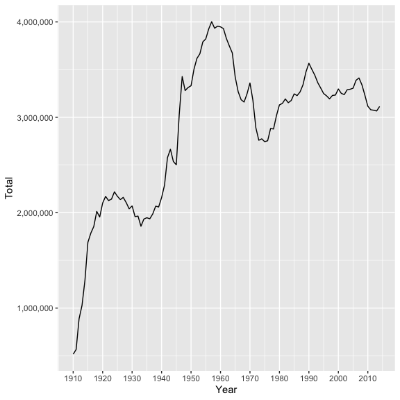
<p class="caption">
Figure 1: Annual Count of Unique Baby Names in the U.S., 1910-2014
</p>

</div>

## Findings

The following chapter summarizes the results of the data analyses.

### Mainstream Analysis

Now I carry out a “mainstream analysis” meaning I check how many
children had the most popular name of the year, differentiated between
male and female names.

<figure>
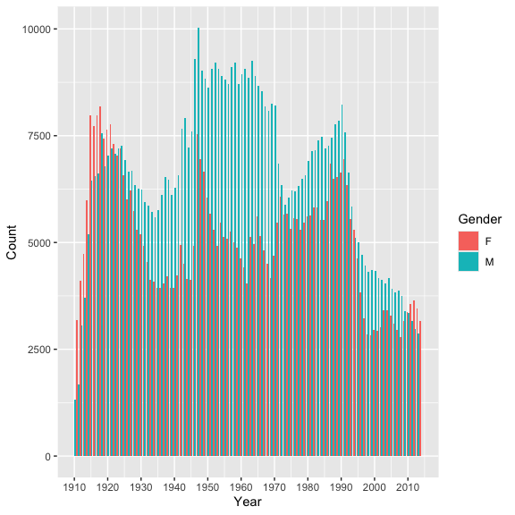
<figcaption aria-hidden="true">Figure 2: Overview of Number of Babys
with the Years’ Most Popular Name</figcaption>
</figure>

It becomes visible, that parents of boys and girls have become more
individualistic when naming their children, resulting in less children
with the same name since the 1990s.

### Persistence Analysis

To analyse whether the persistency of names has changed over the time
horizon 1910 until 2011, a Spearmen Rank Correlation is being calculated
between top 25 names on the country-level in year t0 and t3. The period
had to be limited to 2011 as this is the last year for which the +3
years time lag can be calculated. The results of the persistency
analysis (Figure 3) suggests that persistence of names follows a
decreasing trend overall, indicating that name preferences change faster
today than they did in the mid 19th century. Comparing the means of
Spearmen rank correlation coefficients before and after 1990 has
confirms the hypothesis that popular names persisted slower after 1990.
The mean of correlation coefficients before 1990 amounts to 0.857, while
the mean thereafter reduces to 0.766, indicating faster-paced name
trends.

<div class="figure" style="text-align: center">

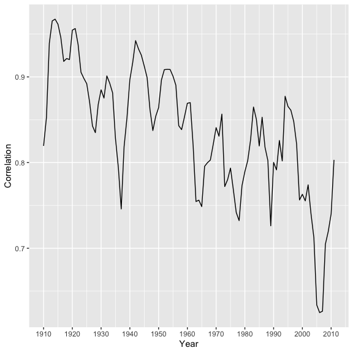
<p class="caption">
Figure 3: Correlation Trend Over Time (1910–2011)
</p>

</div>

However, after correlation reduced considerably between the 1990s and
early years of the present century, this trend has reversed after 2005.
In the year 2011, Spearmen correlation is only slightly lower that in
the beginning of the time series in 1910, indicating a recent shift
towards more higher persistence of names.

### Spike Analysis

The spike analysis was carried out to test which names have experienced
the largest hypes in the period under analysis. Figure 4 displays the 15
mostly hyped names, as indicated by their percentage increase in usage
between two years. Interestingly, 12 out of the 15 names are female
names, indicating names for baby girls are experiencing more extreme
hypes. It has also been analysed, whether these names appear in movie or
music productions. Surprisingly, out of these top 15 most spiked names,
only the name Aja shows a relation to the film industry. The next
subchapter analyses the impact of film and music publications on names
overall.

<table class="table table-striped table-hover" style="color: black; margin-left: auto; margin-right: auto;">
<caption>
Top 15 Baby Name Spikes by Percentage Increase
</caption>
<thead>
<tr>
<th style="text-align:right;">
Year
</th>
<th style="text-align:left;">
Name
</th>
<th style="text-align:left;">
Gender
</th>
<th style="text-align:right;">
% Increase
</th>
</tr>
</thead>
<tbody>
<tr>
<td style="text-align:right;">
1964
</td>
<td style="text-align:left;">
Deneen
</td>
<td style="text-align:left;">
F
</td>
<td style="text-align:right;">
31340.0
</td>
</tr>
<tr>
<td style="text-align:right;">
1994
</td>
<td style="text-align:left;">
Aaliyah
</td>
<td style="text-align:left;">
F
</td>
<td style="text-align:right;">
28140.0
</td>
</tr>
<tr>
<td style="text-align:right;">
1983
</td>
<td style="text-align:left;">
Mallory
</td>
<td style="text-align:left;">
F
</td>
<td style="text-align:right;">
13060.0
</td>
</tr>
<tr>
<td style="text-align:right;">
2010
</td>
<td style="text-align:left;">
Tenley
</td>
<td style="text-align:left;">
F
</td>
<td style="text-align:right;">
12900.0
</td>
</tr>
<tr>
<td style="text-align:right;">
1957
</td>
<td style="text-align:left;">
Tammie
</td>
<td style="text-align:left;">
F
</td>
<td style="text-align:right;">
11580.0
</td>
</tr>
<tr>
<td style="text-align:right;">
1992
</td>
<td style="text-align:left;">
Jalen
</td>
<td style="text-align:left;">
M
</td>
<td style="text-align:right;">
9616.7
</td>
</tr>
<tr>
<td style="text-align:right;">
1978
</td>
<td style="text-align:left;">
Aja
</td>
<td style="text-align:left;">
F
</td>
<td style="text-align:right;">
8620.0
</td>
</tr>
<tr>
<td style="text-align:right;">
2012
</td>
<td style="text-align:left;">
Cataleya
</td>
<td style="text-align:left;">
F
</td>
<td style="text-align:right;">
7600.0
</td>
</tr>
<tr>
<td style="text-align:right;">
1928
</td>
<td style="text-align:left;">
Jeannine
</td>
<td style="text-align:left;">
F
</td>
<td style="text-align:right;">
7440.0
</td>
</tr>
<tr>
<td style="text-align:right;">
1981
</td>
<td style="text-align:left;">
Krystle
</td>
<td style="text-align:left;">
F
</td>
<td style="text-align:right;">
6816.7
</td>
</tr>
<tr>
<td style="text-align:right;">
1968
</td>
<td style="text-align:left;">
Dustin
</td>
<td style="text-align:left;">
M
</td>
<td style="text-align:right;">
6550.0
</td>
</tr>
<tr>
<td style="text-align:right;">
1995
</td>
<td style="text-align:left;">
Lyric
</td>
<td style="text-align:left;">
F
</td>
<td style="text-align:right;">
6320.0
</td>
</tr>
<tr>
<td style="text-align:right;">
1966
</td>
<td style="text-align:left;">
Tabitha
</td>
<td style="text-align:left;">
F
</td>
<td style="text-align:right;">
5960.0
</td>
</tr>
<tr>
<td style="text-align:right;">
2000
</td>
<td style="text-align:left;">
Elian
</td>
<td style="text-align:left;">
M
</td>
<td style="text-align:right;">
5922.2
</td>
</tr>
<tr>
<td style="text-align:right;">
2005
</td>
<td style="text-align:left;">
Mikalah
</td>
<td style="text-align:left;">
F
</td>
<td style="text-align:right;">
5680.0
</td>
</tr>
</tbody>
</table>

### Pop-Culture Analysis

Thereafter, billboard data is being used to check whether famous baby
names relate to music pop-culture. The music_check function organizes
the billboard data by top 20 songs per year and checks whether artist or
song names relate to baby names. It then assigns two dummy columns to
the spikes data frame, telling us whether names appear in top 20 singer
or song names within the time frame 1910 until 2014.

A similar analysis is being done for the movie data stored in hbo_titles
and hbo_credits. In a first step, both data frames are being merged
based on the id column. Therafter, unnecessary columns are deselected
and only films with rating higher than 8.5 and published before 2014
selected. Then, str_detect() is being used to check whether names occur
in movie titles, character or actor names, or the movie description. In
a last step, a dummy column is being added to provide information if the
name is related to a popular movie.

In a last step, it is being analysed, how many names per gender are
related to famous singers, songs or movies. This analysis is insightful
to provide recommendations for the toy company, which elements of pop
culture to get toy name inspiration from.

<table class="table table-striped table-hover" style="color: black; margin-left: auto; margin-right: auto;">
<caption>
Name Representation in Pop Culture
</caption>
<thead>
<tr>
<th style="text-align:left;">
Gender
</th>
<th style="text-align:left;">
pct_artist
</th>
<th style="text-align:left;">
pct_song
</th>
<th style="text-align:left;">
pct_film
</th>
</tr>
</thead>
<tbody>
<tr>
<td style="text-align:left;">
F
</td>
<td style="text-align:left;">
8.4%
</td>
<td style="text-align:left;">
2.6%
</td>
<td style="text-align:left;">
16.1%
</td>
</tr>
<tr>
<td style="text-align:left;">
M
</td>
<td style="text-align:left;">
15.1%
</td>
<td style="text-align:left;">
3.5%
</td>
<td style="text-align:left;">
30.5%
</td>
</tr>
</tbody>
</table>

## Recommendations

In a last step, names from actors or actresses of recent (as of 2020)
and highly rated movies (\> viewer rating 8.5) are being isolated to
serve as source of inspiration for new toy names. Out of these names,
the function hype_name_predictor() chooses names randomly and suggests
them as possible toy names. Movie-related names are being chosen as they
were found to influence baby name choice more than singer or song names.

## Conclusion

In conclusion, the analysis has provided evidence for the fact that baby
name trends have become more fast-paced over the course of the recent
decades. This is supported by the finding that mean correlation
coefficients before 1990 are higher than those after 1990. However, data
visualization in @ref(fig:correlation)) suggests a recent increase in
correlation coefficients, indicating a slow-down of the previous
fast-paced name trend development.

To analyse the sources of spikes in names over the years, billboard data
on famous singers and songs, as well as Hbo data on movies, movie
characters and actors has been analysed for their effect on name
popularity. The findings of this analysis suggest that film-related
names have had the largest effect on both male (30%) and female names
(16%), followed by artist names (5.8% on female and 10.5% on male
names). The lowest effect was found by song names, only contributing to
2.5% of male and 1.7% of female names.

These findings suggest that toy names should be inspired by movie
characters or actresses, as these are the major sources of inspiration
for baby names. Looking at recent film trends, possible candidates could
for instance be Mahershala, Ivana or Yuki.

# Question 2: Metallica and Coldplay

## Introduction

Metallica and Coldplay are bands that are probably known to everyone
interested into music. This short report analyses the development of
these two bands’ musical progression over time, by analysing the success
of their songs, as well as changes in their styles. The results are
being set into context with overall trends in the music industry in the
same period.

## Data Overview

``` r
coldplay <- read.csv("data/Coldplay_vs_Metallica/Coldplay.csv")
metallica <- read.csv("data/Coldplay_vs_Metallica/metallica.csv")
spotify <- readRDS("data/Coldplay_vs_Metallica/Broader_Spotify_Info.rds")
billboard_100 <- readRDS("data/Coldplay_vs_Metallica/charts.rds")
```

In a first step, the data frames for coldplay, metallica, as well as the
spotify songs are being cleaned. Thereafter, they are being joined to
the final data set called “bands”.

``` r
source("code/Adjust_Data.R")
final_bands <- adjust_data(coldplay_data = coldplay, metallica_data = metallica, spotify_data = spotify)
```

## Analysis

### Average Song Duration (Metallica vs. Coldplay vs. Others)

Next, average duration of songs over time is compared between Metallica,
Coldplay and other bands. The results show that Metallica songs are
longer than other bands’ songs on average.

``` r
source("code/Song_Duration_Over_Time.R")
bands <- readRDS("results/bands.rds")
song_duration_over_time(bands)
```

<figure>
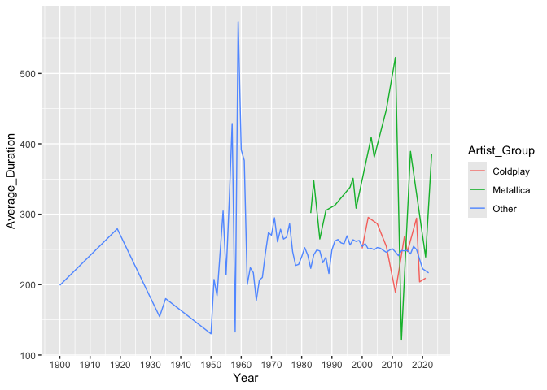
<figcaption aria-hidden="true">Figure 4: Average Song Duration
Trends</figcaption>
</figure>

### Top 10 Most Popular Albums (Metallica vs. Coldplay)

Moreover, the top 10 most popular albums of Metallica and Coldplay are
being visualized.

``` r
source("code/Top_Albums.R")
top_albums <- bind_rows(
    top_albums(bands, "Coldplay"),
    top_albums(bands, "Metallica"))
plot_data <- bands %>%
    filter(version == "studio") %>%
    semi_join(top_albums, by = c("artist", "album")) %>%
    mutate(album = fct_reorder(album, popularity, .fun = median))
source("code/Top_10_Studio.R")
top_10_studio(plot_data)
```

<figure>
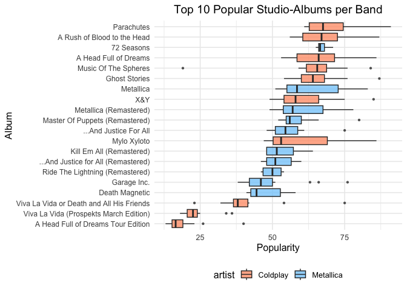
<figcaption aria-hidden="true">Figure 5: Top 10 Most Popular Albums
(Metallica and Coldplay)</figcaption>
</figure>

### Average Audio Features (Metallica vs. Coldplay)

Furthermore, average audio features of Metallica and Coldplay songs are
analysed and presented in a table.

``` r
source("code/Calculate_Band_Stats.R")
bands <- readRDS("results/bands.rds")
combined_analysis <- calculate_band_stats(bands, "studio")
knitr::kable(combined_analysis, 
             caption = "Comparison of Average Audio Features: Coldplay vs. Metallica",
             col.names = c("Feature", "Coldplay", "Metallica"),
             align = c("c", "l", "r")) %>%
kableExtra::kable_styling("striped", full_width = FALSE)
```

<table class="table table-striped" style="color: black; width: auto !important; margin-left: auto; margin-right: auto;">
<caption>
Comparison of Average Audio Features: Coldplay vs. Metallica
</caption>
<thead>
<tr>
<th style="text-align:center;">
Feature
</th>
<th style="text-align:left;">
Coldplay
</th>
<th style="text-align:right;">
Metallica
</th>
</tr>
</thead>
<tbody>
<tr>
<td style="text-align:center;">
danceability
</td>
<td style="text-align:left;">
0.427
</td>
<td style="text-align:right;">
0.414
</td>
</tr>
<tr>
<td style="text-align:center;">
energy
</td>
<td style="text-align:left;">
0.562
</td>
<td style="text-align:right;">
0.798
</td>
</tr>
<tr>
<td style="text-align:center;">
loudness
</td>
<td style="text-align:left;">
-9.411
</td>
<td style="text-align:right;">
-8.361
</td>
</tr>
<tr>
<td style="text-align:center;">
speechiness
</td>
<td style="text-align:left;">
0.041
</td>
<td style="text-align:right;">
0.072
</td>
</tr>
<tr>
<td style="text-align:center;">
acousticness
</td>
<td style="text-align:left;">
0.300
</td>
<td style="text-align:right;">
0.078
</td>
</tr>
<tr>
<td style="text-align:center;">
instrumentalness
</td>
<td style="text-align:left;">
0.254
</td>
<td style="text-align:right;">
0.374
</td>
</tr>
<tr>
<td style="text-align:center;">
liveness
</td>
<td style="text-align:left;">
0.200
</td>
<td style="text-align:right;">
0.185
</td>
</tr>
<tr>
<td style="text-align:center;">
valence
</td>
<td style="text-align:left;">
0.245
</td>
<td style="text-align:right;">
0.455
</td>
</tr>
<tr>
<td style="text-align:center;">
tempo
</td>
<td style="text-align:left;">
126.610
</td>
<td style="text-align:right;">
122.162
</td>
</tr>
<tr>
<td style="text-align:center;">
duration
</td>
<td style="text-align:left;">
243.591
</td>
<td style="text-align:right;">
304.211
</td>
</tr>
</tbody>
</table>

### Average Song Popularity (Metallica vs. Coldplay)

In the next step, the average popularity of songs of Metallica and
Coldplay is being compared to get an understanding which of the bands is
more popular. The results suggest that Coldplay songs are on average
more popular, even though the band Metallica is longer standing and
hence more established on the music market than Coldplay.

<figure>
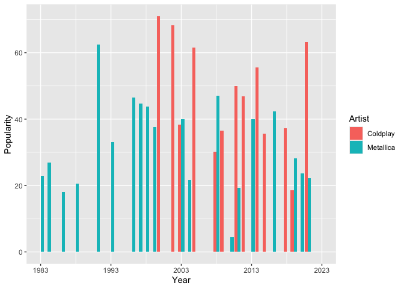
<figcaption aria-hidden="true">Figure 6: Average Song Pupularity
(Metallica vs. Coldplay)</figcaption>
</figure>

### Overview of Audio Features Over Time (Metallica vs. Coldplay vs. Others)

Lastly, average audio features of Metallica and Coldplay songs are
compared to average other songs over time. This allows to trace music
trends and evaluate whether the two bands are in line with overall
trends, as well as identify unique selling points of the bands. It
becomes apparent that Metallica is lowder and more energetic and live
than Coldplay and other artists. Coldplay is speechier and more
danceable and instrumental on average.

<figure>
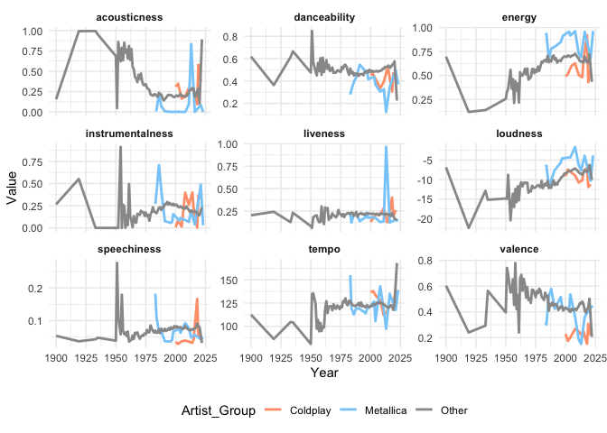
<figcaption aria-hidden="true">Figure 7: Average Audio Features Over
Time</figcaption>
</figure>

## Conclusion

The analysis has shown that Coldplay songs are on average more popular
than Metallica ones. Furthermore, their music differs in the categories
under analysis (e.g. energy, valence). Metallica songs tend to be longer
than Coldplay song and the average of other interprets songs. The
detailed audio feature analysis has shown that both bands have unique
selling points, differentiating their music from overall music trends
and average other bands.

# Question 3: Insights into Streaming Consumer Preferences

## Introduction

In times of declining Netflix audiences and increasing production costs,
it is more important than ever to understand what audiences really want.
This brief document analyses Netflix data up to 2023, as well as data
from the Internet Movie Database to understand which genres audiences
from different parts of the world value. This analysis includes natural
language processing to analyse sentiment of text-based movie ratings.
The results of the sentiment analysis are then plotted against movie
ratings, to show whether the sentiment of ratings correlates with the
ratings assigned.

``` r
Titles <- readRDS("data/netflix/titles.rds")
Credits <- readRDS("data/netflix/credits.rds")
Movie_Info <- read.csv("data/netflix/netflix_movies.csv")
```

``` r
source("code/Merge_Df.R")
merge_df(Titles, Movie_Info)
```

## Analysis Results

The following section briefly discusses results of the film and series
analysis.

## Length Development

In times of shorter concentration span through social media usage,
screening time is known to be a decisive factor in determining a movie’s
success. Hence, the average length of movies and series has been
analysed over time. It becomes visible that time has declined especially
after 2005, supporting the hypothesis of reduced concentration span of
viewers. This development is likely driven by the rising popularity of
series over the past years. It is therefore advisable to offer shorter
over longer movies on the platform, to cater for the demand of shorter
productions.

``` r
region_data <- readRDS("results/region_data.rds")
source("code/Length_Development.R")
length_development(region_data)
```

<figure>
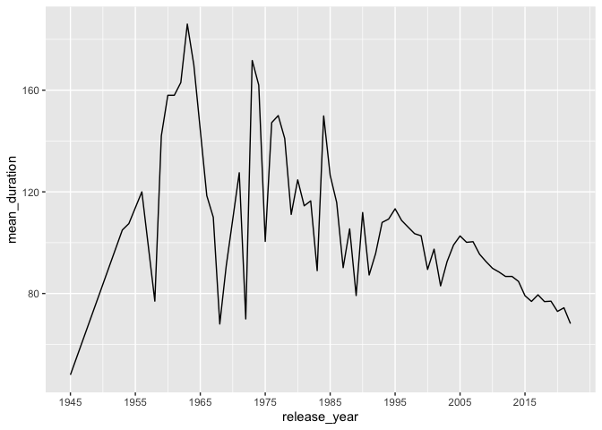
<figcaption aria-hidden="true">Figure 8: Average Screen Time per
Year</figcaption>
</figure>

## Genre Popularity by Region

In a next step, genre popularity by region was analysed to gain an
overview which movies should be offered to which audience group. The
insights can be used to tailor the offering of the new platform to users
preferences in order to optimize the market fit of the product.

``` r
source("code/Sentiment_Analysis.R")
sentiment_analysis(region_data)
```

``` r
data_sentiment <- readRDS("results/data_sentiment.rds")
source("code/Genre_Region_Summary.R")
genre_region_summary(data_sentiment)
```

<figure>
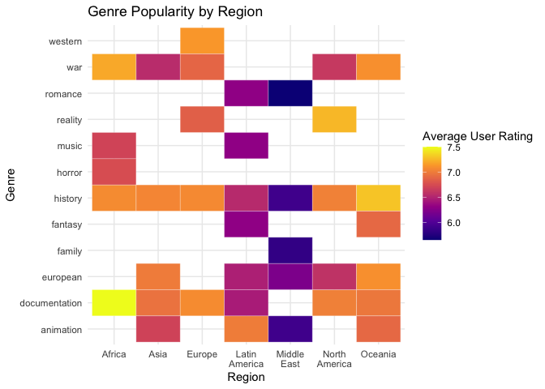
<figcaption aria-hidden="true">Figure 9: Genre Popularity by
Region</figcaption>
</figure>

## Sentiment vs. Rating Analysis

Lastly, it has been analysed whether sentiment of ratings written on
online platforms aligns with actual ratings assigned. The results
suggest that sentiment of ratings tends to be more negative than overall
user ratings. This gives the impression, that ratings overall are
written more critically, than overall ratings assigned.

``` r
top_genres <- readRDS("results/top_genres.rds")
source("code/scatterplot_sentiment_rating.R")
scatterplot <- plot_sentiment_vs_rating(top_genres)
ggsave("results/plot_sentiment_vs_rating.png", plot = scatterplot, width = 6, height = 5, dpi = 300)
print(scatterplot)
```

<figure>
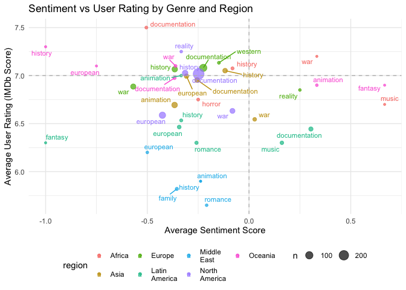
<figcaption aria-hidden="true">Figure 10: Sentiment vs. User Rating by
Genre and Region</figcaption>
</figure>

## Conclusion

The analysis suggests that offerings on the new platform should be
rather short. In addition, the genre preference matrix gives insights
which genres to focus on per region. Following these insights, the new
platform will ensure that the audiences demands are met, such that
offerings have a higher possibility of being successes.

# Question 4: Billionaires

``` r
Billions <- read.csv("data/Billions/billionaires.csv")
```

## Introduction 

This report analyses data on billionaires to test three hypotheses:

1.  **Hypothesis 1:** The United States has a higher number of self-made
    billionaires—those who did not inherit their wealth—compared to
    other (non-US) regions.

2.  **Hypothesis 2:** Among self-made billionaires, the share who
    accumulated wealth by founding businesses in the consumer services
    sector has declined over time, while the share in the technology
    sector has increased.

3.  **Hypothesis 3:** There is a positive relationship between a
    country’s GDP and the level of innovation in the consumer services
    sector.

## Billionaire Analysis

### Share of Selfmade Billionaires per Region

To analyse whether the first statement is true, the share of US-based
self-made billionaires is plotted against the share of non-US-based
self-made billionaires (here called Emerging Economies). The results
show that the hypothesis is true: the US has more self-made billionaires
than other countries.

``` r
source("code/Selfmade_Analysis.R")
selfmade_analysis(Billions)
selfmade_share <- readRDS("results/selfmade_share.rds")
source("code/Selfmade_Visualization.R")
selfmade_visualization(selfmade_share)
```

<figure>
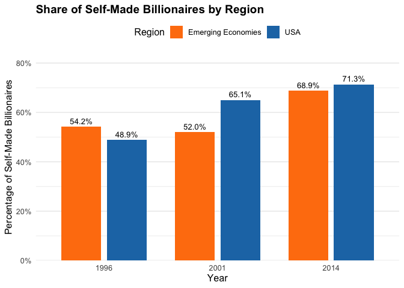
<figcaption aria-hidden="true">Figure 11: Region Analysis</figcaption>
</figure>

### Industry Shares

Next we test the second hypothesis, that the share of self-made
billionaires that got rich by founding businesses in consumer services
has declined, while the share of technology self-made billionaires has
increased. The data is being grouped by industries and an industry share
by year is being calculated. The labels on the graph are a bit deterred,
but the results suggest that the second hypothesis is not entirely true.
The share of overall billionaires in consumer services has first
increased and then reduced, remaining on a similar level in 2014 as in
1996. The share of tech billionaires follows a similar pattern.

``` r
analysis <- readRDS("results/analysis.rds")
source("code/Industry_Trends.R")
industry_trends(analysis)
```


### Correlation

To test the third hypothesis that richer countries provide more
innovation in consumer services, a correlation is carried out. The
results suggest that there is indeed a positive relationship between
(logged) GDP and the share of innovations in the consumer industry.

``` r
source("code/Correlation_Analysis.R")
correlation_analysis(analysis)
```

<figure>
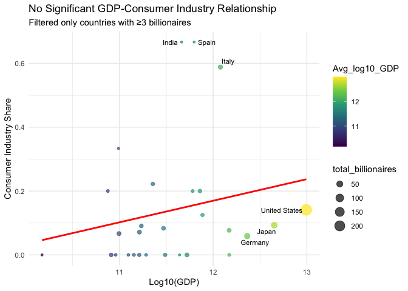
<figcaption aria-hidden="true">Figure 13: Correlation log(GDP) and
Consumer Innovation</figcaption>
</figure>

## Conclusion

In summary, hypothesis one and three were prooved correct, while
hypothesis two was rejected.

# Question 5: Health

In a second step after reading in the necessary packages (done in the
beginning of this document), the health data is loaded.

``` r
Health <- "data/Health/HealthCare.csv" %>% read.csv()
```

## Introduction

This presentation presents the results of a data analysis of WHO health
data to explore the impact of stress, physical exercise, and sleep on
health.

In the course of the analysis, two hypotheses were tested:

1.  **Hypothesis 1:** Sleeping is more important to health than
    exercise.
2.  **Hypothesis 2:** Living a stress free lifestyle has a major impact
    on health.

## Research Question

The underlying research question of this analysis was:

“Which are the main influencing factors on health and how can we use
these insights to improve it?”

## Data

The data used for this analysis is WHO data on health, comprising data
on individuals ages, weight, sleep, exercise, stress levels, amongst
others.

## Methodology

The analysis consisted of a simple linear regression with health as
dependent variable, sleep, excercise and stress as independent
variables.

## Challenge: What is health?

A challenge I encountered was to determine which variable is used for
health. It is generally challenging to measure health, as it consists of
many factors. For the purpose of this analysis, health will be explained
by excess body weight. This simplification is being made in the absence
of other health indicators such as BMI.

## Results

The regression results suggest that Exercise has a statistically
significant positive relationship on health, while for Sleep and Stress
no statistically significant effects were found.

<!-- preamble start -->

    <script>

      function styleCell_ruod9l5e9yxldb29aelr(i, j, css_id) {
          var table = document.getElementById("tinytable_ruod9l5e9yxldb29aelr");
          var cell = table.rows[i]?.cells[j];  // Safe navigation to avoid errors
          if (cell) {
              console.log(`Styling cell at (${i}, ${j}) with class ${css_id}`);
              cell.classList.add(css_id);
          } else {
              console.warn(`Cell at (${i}, ${j}) not found.`);
          }
      }
      function insertSpanRow(i, colspan, content) {
        var table = document.getElementById('tinytable_ruod9l5e9yxldb29aelr');
        var newRow = table.insertRow(i);
        var newCell = newRow.insertCell(0);
        newCell.setAttribute("colspan", colspan);
        // newCell.innerText = content;
        // this may be unsafe, but innerText does not interpret <br>
        newCell.innerHTML = content;
      }
      function spanCell_ruod9l5e9yxldb29aelr(i, j, rowspan, colspan) {
        var table = document.getElementById("tinytable_ruod9l5e9yxldb29aelr");
        const targetRow = table.rows[i];
        const targetCell = targetRow.cells[j];
        for (let r = 0; r < rowspan; r++) {
          // Only start deleting cells to the right for the first row (r == 0)
          if (r === 0) {
            // Delete cells to the right of the target cell in the first row
            for (let c = colspan - 1; c > 0; c--) {
              if (table.rows[i + r].cells[j + c]) {
                table.rows[i + r].deleteCell(j + c);
              }
            }
          }
          // For rows below the first, delete starting from the target column
          if (r > 0) {
            for (let c = colspan - 1; c >= 0; c--) {
              if (table.rows[i + r] && table.rows[i + r].cells[j]) {
                table.rows[i + r].deleteCell(j);
              }
            }
          }
        }
        // Set rowspan and colspan of the target cell
        targetCell.rowSpan = rowspan;
        targetCell.colSpan = colspan;
      }
      // tinytable span after
      window.addEventListener('load', function () {
          var cellsToStyle = [
            // tinytable style arrays after
          { positions: [ { i: 15, j: 1 },  ], css_id: 'tinytable_css_2zfnbn4ohr8ptxyuyjgv',}, 
          { positions: [ { i: 8, j: 1 },  ], css_id: 'tinytable_css_z6th7jjp6qya48s0bibh',}, 
          { positions: [ { i: 1, j: 1 }, { i: 2, j: 1 }, { i: 3, j: 1 }, { i: 4, j: 1 }, { i: 5, j: 1 }, { i: 6, j: 1 }, { i: 7, j: 1 }, { i: 12, j: 1 }, { i: 9, j: 1 }, { i: 10, j: 1 }, { i: 11, j: 1 }, { i: 13, j: 1 }, { i: 14, j: 1 },  ], css_id: 'tinytable_css_2mewtent57m4ffozk24c',}, 
          { positions: [ { i: 0, j: 1 },  ], css_id: 'tinytable_css_uqvbs7b7ykpnlend8xno',}, 
          { positions: [ { i: 15, j: 0 },  ], css_id: 'tinytable_css_8kz13s835lb9f55cmk1s',}, 
          { positions: [ { i: 8, j: 0 },  ], css_id: 'tinytable_css_3thiv6ize5tknwf9xm2i',}, 
          { positions: [ { i: 1, j: 0 }, { i: 2, j: 0 }, { i: 3, j: 0 }, { i: 4, j: 0 }, { i: 5, j: 0 }, { i: 6, j: 0 }, { i: 7, j: 0 }, { i: 12, j: 0 }, { i: 9, j: 0 }, { i: 10, j: 0 }, { i: 11, j: 0 }, { i: 13, j: 0 }, { i: 14, j: 0 },  ], css_id: 'tinytable_css_b9e92kq1xz1kwcv9fr60',}, 
          { positions: [ { i: 0, j: 0 },  ], css_id: 'tinytable_css_kk4mt3d7wcf0dp98l1fr',}, 
          ];

          // Loop over the arrays to style the cells
          cellsToStyle.forEach(function (group) {
              group.positions.forEach(function (cell) {
                  styleCell_ruod9l5e9yxldb29aelr(cell.i, cell.j, group.css_id);
              });
          });
      });
    </script>

    <style>
      /* tinytable css entries after */
      .table td.tinytable_css_2zfnbn4ohr8ptxyuyjgv, .table th.tinytable_css_2zfnbn4ohr8ptxyuyjgv { text-align: center; border-bottom: solid #d3d8dc 0.1em; }
      .table td.tinytable_css_z6th7jjp6qya48s0bibh, .table th.tinytable_css_z6th7jjp6qya48s0bibh { text-align: center; border-bottom: solid black 0.05em; }
      .table td.tinytable_css_2mewtent57m4ffozk24c, .table th.tinytable_css_2mewtent57m4ffozk24c { text-align: center; }
      .table td.tinytable_css_uqvbs7b7ykpnlend8xno, .table th.tinytable_css_uqvbs7b7ykpnlend8xno { text-align: center; border-top: solid #d3d8dc 0.1em; border-bottom: solid #d3d8dc 0.05em; }
      .table td.tinytable_css_8kz13s835lb9f55cmk1s, .table th.tinytable_css_8kz13s835lb9f55cmk1s { text-align: left; border-bottom: solid #d3d8dc 0.1em; }
      .table td.tinytable_css_3thiv6ize5tknwf9xm2i, .table th.tinytable_css_3thiv6ize5tknwf9xm2i { text-align: left; border-bottom: solid black 0.05em; }
      .table td.tinytable_css_b9e92kq1xz1kwcv9fr60, .table th.tinytable_css_b9e92kq1xz1kwcv9fr60 { text-align: left; }
      .table td.tinytable_css_kk4mt3d7wcf0dp98l1fr, .table th.tinytable_css_kk4mt3d7wcf0dp98l1fr { text-align: left; border-top: solid #d3d8dc 0.1em; border-bottom: solid #d3d8dc 0.05em; }
    </style>
    <div class="container">
      <table class="table table-borderless" id="tinytable_ruod9l5e9yxldb29aelr" style="width: auto; margin-left: auto; margin-right: auto;" data-quarto-disable-processing='true'>
        <thead>
        <caption>Table 1 – Regression: Health on Exercise, Sleep, Stress</caption>
              <tr>
                <th scope="col"> </th>
                <th scope="col">(1)</th>
              </tr>
        </thead>
        <tfoot><tr><td colspan='2'>+ p &lt; 0.1, * p &lt; 0.05, ** p &lt; 0.01, *** p &lt; 0.001</td></tr></tfoot>
        <tbody>
                <tr>
                  <td>(Intercept)</td>
                  <td>246.148**</td>
                </tr>
                <tr>
                  <td></td>
                  <td>(87.845)</td>
                </tr>
                <tr>
                  <td>Exercise</td>
                  <td>285.774***</td>
                </tr>
                <tr>
                  <td></td>
                  <td>(21.394)</td>
                </tr>
                <tr>
                  <td>Sleep</td>
                  <td>30.220</td>
                </tr>
                <tr>
                  <td></td>
                  <td>(20.625)</td>
                </tr>
                <tr>
                  <td>Stress</td>
                  <td>−5.357</td>
                </tr>
                <tr>
                  <td></td>
                  <td>(8.851)</td>
                </tr>
                <tr>
                  <td>Num.Obs.</td>
                  <td>100</td>
                </tr>
                <tr>
                  <td>R2</td>
                  <td>0.652</td>
                </tr>
                <tr>
                  <td>R2 Adj.</td>
                  <td>0.642</td>
                </tr>
                <tr>
                  <td>AIC</td>
                  <td>1370.7</td>
                </tr>
                <tr>
                  <td>BIC</td>
                  <td>1383.7</td>
                </tr>
                <tr>
                  <td>Log.Lik.</td>
                  <td>−680.331</td>
                </tr>
                <tr>
                  <td>RMSE</td>
                  <td>217.97</td>
                </tr>
        </tbody>
      </table>
    </div>

<!-- hack to avoid NA insertion in last line -->

## Limitations

In general, it is difficult to measure health as it is expressed in many
different aspects. It includes physical aspects such as sick days or
physical fitness, but also mental dimensions such as resilience to
stress or the absence of psychological issues. Furthermore, the input
factors of health are difficult to measure, as factors like genetics,
sleep, nutrition, external factors, but also access to health care might
influence it. Therefore it is difficult to capture health relationships
accurately through data. On top of that, there is a substantial risk of
reverse causality, as poor health might itself lead to higher stress
levels, reduced physical activity, or sleep problems. This makes it
harder to clearly separate causes from effects when interpreting the
results.

## Conclusion

This presentation discussed the effects of exercises, sleep and stress
on health by means of a simple linear regression analysis. The results
suggest that only physical exercise has a statistically significant
effect on health. Therefore, both hypotheses need to be rejected. Major
limitations of this analysis have been mentioned. I thank you for your
attention and am looking forward to hearing your feedback.
