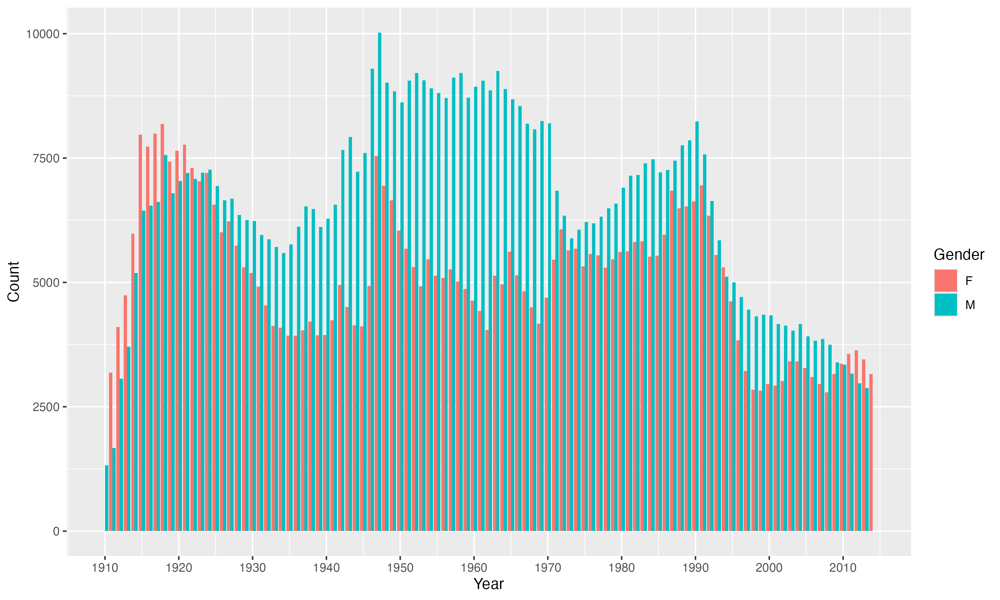

```{r setup, include=FALSE}
knitr::opts_chunk$set(echo = TRUE)
```

This ReadMe summarizes my replies to the five questions of the Data Science 48h exam 2025.
In order to not overload this report, complete data wrangling and calculations can be found in the ReadMe files of the respective tasks folders.

# Preparations
## Loading Necessary Packages

To make sure that the ReadMe runs, the following, neccessary packages need to be loaded.

```{r, message=FALSE, warning=FALSE}
library(tidyverse)
library(scales)
library(dplyr)
library(kableExtra)
library(tidyr)
library(xtable)
library(stringr)
library(tidytext)
library(ggplot2)
library(ggrepel)
library(modelsummary) 
library(broom)
```

## Accessing the Code

My complete code can be found and downloaded on [GitHub](https://github.com/jellamar/29835569/).

# Question 1: Baby Names

## Introduction 

This report analyses trends in US baby names over the years 1910 until 2014. The analysis is supported by data on famous singers and actors names in the same time period. In the course of the analysis, persistence and volatility of name popularity are being explored over time, to analyse whether names that are popular in a given year tend to remain popular three years in the future.

To do this, I calculate and visualise the Spearman rank correlation for the 25 most popular names in each year, comparing them to the top names three years thereafter. This provides a measure of how stable or fast-changing baby name trends have been and whether these trends have become more volatile after 1990.

In addition, I investigate sudden surges in name popularity and cross-reference these with publications in music and film. Specifically, I cross-check, whether popular names are found in film or music data as names of songs, singers, actresses or characters. By combining name data with cultural references, the analysis aims to identify potential drivers of naming trends and provide guidance for selecting toy character names that have the potential to be liked by future baby generations and their parents.

## Methodology  

### Data Overview

In a first step, data is loaded in from the data folder and stored in variables.

```{r data-load, echo=TRUE, message=FALSE, warning=FALSE, include=FALSE}
baby_names <- readRDS("data/US_Baby_names/Baby_Names_By_US_State.rds")
billboard <- readRDS("data/US_Baby_names/charts.rds")
hbo_titles <- readRDS("data/US_Baby_names/HBO_titles.rds")
hbo_credits <- readRDS("data/US_Baby_names/HBO_credits.rds")
```

Consequently, data is being checked for NAs and duplicates.

```{r,  echo=TRUE, include=FALSE, message=FALSE, warning=FALSE}
source("code/Check_Data.R")
check_data(baby_names, names)
check_data(billboard)
check_data(hbo_titles)
check_data(hbo_credits)
```

The baby names dataset comprises US baby names from 1910 to 2014, with state-level observations differentiated by gender. In the next step, a graph is being created, showing the total number of babys in the data set over time, to get a feeling for the data. As shown in Figure 1, the total number of recorded names demonstrates significant variation over this 104-year period.

```{r name-count, fig.cap="Figure 1: Annual Count of Unique Baby Names in the U.S., 1910-2014", echo=FALSE, fig.align='center', fig.width=6, fig.height=6}
source("code/Count_Babynames.R")
counting <- count_babynames(baby_names)
source("code/Line_Plot.R")
count_name_year_plot <- line_plot(counting, "Year", "Total") + scale_y_continuous(labels = comma)
print(count_name_year_plot)
ggsave(filename = "results/count_name_year_plot.png", plot = count_name_year_plot, width = 10, height = 6, dpi = 300)
```

## Findings

The following chapter summarizes the results of the data analyses.

### Mainstream Analysis

Now I carry out a "mainstream analysis" meaning I check how many children had the most popular name of the year, differentiated between male and female names.

```{r, fig.cap="Figure 2: Overview of Number of Babys with the Years' Most Popular Name", echo=FALSE, message=FALSE, warning=FALSE, fig.width=6, fig.height=6}
source("code/Mainstream_Analysis.R")
mainstream <- mainstream_analysis(baby_names)
source("code/Bar_Plot.R")
mainstream_bar_plot <- bar_plot(mainstream, "Year", "Count", "Gender")
print(mainstream_bar_plot)
ggsave(filename = "results/mainstream_bar_plot.png", plot = mainstream_bar_plot, width = 10, height = 6, dpi = 300)
#
```

It becomes visible, that parents of boys and girls have become more individualistic when naming their children, resulting in less children with the same name since the 1990s.

### Persistence Analysis

To analyse whether the persistency of names has changed over the time horizon 1910 until 2011, a Spearmen Rank Correlation is being calculated between top 25 names on the country-level in year t0 and t3. The period had to be limited to 2011 as this is the last year for which the +3 years time lag can be calculated. The results of the persistency analysis (Figure 3) suggests that persistence of names follows a decreasing trend overall, indicating that name preferences change faster today than they did in the mid 19th century. Comparing the means of Spearmen rank correlation coefficients before and after 1990 has confirms the hypothesis that popular names persisted slower after 1990. The mean of correlation coefficients before 1990 amounts to 0.857, while the mean thereafter reduces to 0.766, indicating faster-paced name trends. 


```{r correlation-trend, fig.cap="Figure 3: Correlation Trend Over Time (1910–2011)", echo=FALSE, fig.align='center', fig.pos='H', label="fig-correlation", message=FALSE, warning=FALSE, fig.width=6, fig.height=6}

source("code/Calculate_Spearman_Correlation.R")
calculate_spearman_correlation(baby_names)
source("code/Line_Plot.R")
spear_results <- readRDS("results/spearman_correlation_results.rds")
correlation_line_plot <- line_plot(spear_results, "Year", "Correlation")
print(correlation_line_plot, width = 8, height = 6)
ggsave(filename = "results/correlation_line_plot.png", plot = correlation_line_plot, width = 8, height = 6, dpi = 300)

```

However, after correlation reduced considerably between the 1990s and early years of the present century, this trend has reversed after 2005. In the year 2011, Spearmen correlation is only slightly lower that in the beginning of the time series in 1910, indicating a recent shift towards more higher persistence of names.

### Spike Analysis

The spike analysis was carried out to test which names have experienced the largest hypes in the period under analysis. Figure 4 displays the 15 mostly hyped names, as indicated by their percentage increase in usage between two years. Interestingly, 12 out of the 15 names are female names, indicating names for baby girls are experiencing more extreme hypes. It has also been analysed, whether these names appear in movie or music productions. Surprisingly, out of these top 15 most spiked names, only the name Aja shows a relation to the film industry. The next subchapter analyses the impact of film and music publications on names overall. 

```{r load-spikes, echo=FALSE, tbl.cap="Table 1: Top 15 Baby Name Spikes", label="top-spikes", message=FALSE, warning=FALSE}
source("code/Spike_Analysis.R")
spike_analysis(baby_names)
top_spikes_table <- read.csv("results/top_spikes.csv")
knitr::kable(top_spikes_table,
             caption = "Top 15 Baby Name Spikes by Percentage Increase",
             col.names = c("Year", "Name", "Gender", "% Increase"),
             digits = 1) %>%
    kableExtra::kable_styling(bootstrap_options = c("striped", "hover"))
```


### Pop-Culture Analysis

Thereafter, billboard data is being used to check whether famous baby names relate to music pop-culture. The music_check function organizes the billboard data by top 20 songs per year and checks whether artist or song names relate to baby names. It then assigns two dummy columns to the spikes data frame, telling us whether names appear in top 20 singer or song names within the time frame 1910 until 2014. 


```{r music-check,  echo=FALSE, message=FALSE, warning=FALSE}
source("code/Music_Check.R")
music_check(billboard)
```

A similar analysis is being done for the movie data stored in hbo_titles and hbo_credits. In a first step, both data frames are being merged based on the id column. Therafter, unnecessary columns are deselected and only films with rating higher than 8.5 and published before 2014 selected. Then, str_detect() is being used to check whether names occur in movie titles, character or actor names, or the movie description. In a last step, a dummy column is being added to provide information if the name is related to a popular movie. 

```{r film-check,  echo=FALSE, message=FALSE, warning=FALSE}
source("code/Film_Check.R")
film_check(hbo_titles, hbo_credits)
```

In a last step, it is being analysed, how many names per gender are related to famous singers, songs or movies. 
This analysis is insightful to provide recommendations for the toy company, which elements of pop culture to get toy name inspiration from. 

```{r spikes,  echo=FALSE, message=FALSE, warning=FALSE}
spikes <- readRDS("results/spikes.rds")
source("code/Name_Pop_Culture_Check.R")
check <- name_pop_culture_check(spikes)
check
```

## Recommendations

In a last step, names from actors or actresses of recent (as of 2020) and highly rated movies (> viewer rating 8.5) are being isolated to serve as source of inspiration for new toy names. Out of these names, the function hype_name_predictor() chooses names randomly and suggests them as possible toy names. Movie-related names are being chosen as they were found to influence baby name choice more than singer or song names. 

```{r recommendations, message=FALSE, warning=FALSE, include=FALSE, tbl.cap="Table 2: Recommendations for Toy Names"}
hbo_total <- readRDS("results/hbo_total.rds")
source("code/Hype_Name_Predictor.R")
hype_name_predictor(hbo_total)
```


## Conclusion

In conclusion, the analysis has provided evidence for the fact that baby name trends have become more fast-paced over the course of the recent decades. This is supported by the finding that mean correlation coefficients before 1990 are higher than those after 1990. However, data visualization in \@ref(fig:correlation)) suggests a recent increase in correlation coefficients, indicating a slow-down of the previous fast-paced name trend development.

To analyse the sources of spikes in names over the years, billboard data on famous singers and songs, as well as Hbo data on movies, movie characters and actors has been analysed for their effect on name popularity. The findings of this analysis suggest that film-related names have had the largest effect on both male (30%) and female names (16%), followed by artist names (5.8% on female and 10.5% on male names). The lowest effect was found by song names, only contributing to 2.5% of male and 1.7% of female names. 

These findings suggest that toy names should be inspired by movie characters or actresses, as these are the major sources of inspiration for baby names. Looking at recent film trends, possible candidates could for instance be Mahershala, Ivana or Yuki. 

\newpage

# Question 2: Metallica and Coldplay

## Introduction

Metallica and Coldplay are bands that are probably known to everyone interested into music. This short report analyses the development of these two bands' musical progression over time, by analysing the success of their songs, as well as changes in their styles. The results are being set into context with overall trends in the music industry in the same period.

## Data Overview

```{r, message=FALSE, warning=FALSE}
coldplay <- read.csv("data/Coldplay_vs_Metallica/Coldplay.csv")
metallica <- read.csv("data/Coldplay_vs_Metallica/metallica.csv")
spotify <- readRDS("data/Coldplay_vs_Metallica/Broader_Spotify_Info.rds")
billboard_100 <- readRDS("data/Coldplay_vs_Metallica/charts.rds")
```

In a first step, the data frames for coldplay, metallica, as well as the spotify songs are being cleaned. Thereafter, they are being joined to the final data set called "bands".

```{r, message=FALSE, warning=FALSE}
source("code/Adjust_Data.R")
final_bands <- adjust_data(coldplay_data = coldplay, metallica_data = metallica, spotify_data = spotify)

```

## Analysis
### Average Song Duration (Metallica vs. Coldplay vs. Others)

Next, average duration of songs over time is compared between Metallica, Coldplay and other bands. The results show that Metallica songs are longer than other bands' songs on average. 


```{r, message=FALSE, warning=FALSE, fig.cap="Figure 4: Average Song Duration Trends"}
source("code/Song_Duration_Over_Time.R")
bands <- readRDS("results/bands.rds")
song_duration_over_time(bands)
```

### Top 10 Most Popular Albums (Metallica vs. Coldplay)

Moreover, the top 10 most popular albums of Metallica and Coldplay are being visualized.

```{r, width = 5, message=FALSE, warning=FALSE, fig.cap="Figure 5: Top 10 Most Popular Albums (Metallica and Coldplay)"}
source("code/Top_Albums.R")
top_albums <- bind_rows(
    top_albums(bands, "Coldplay"),
    top_albums(bands, "Metallica"))
plot_data <- bands %>%
    filter(version == "studio") %>%
    semi_join(top_albums, by = c("artist", "album")) %>%
    mutate(album = fct_reorder(album, popularity, .fun = median))
source("code/Top_10_Studio.R")
top_10_studio(plot_data)
```

### Average Audio Features (Metallica vs. Coldplay)

Furthermore, average audio features of Metallica and Coldplay songs are analysed and presented in a table.

```{r, tbl.cap="Table 3: Comparison of Average Audio Features: Coldplay vs. Metallica", message=FALSE, warning=FALSE}
source("code/Calculate_Band_Stats.R")
bands <- readRDS("results/bands.rds")
combined_analysis <- calculate_band_stats(bands, "studio")
knitr::kable(combined_analysis, 
             caption = "Comparison of Average Audio Features: Coldplay vs. Metallica",
             col.names = c("Feature", "Coldplay", "Metallica"),
             align = c("c", "l", "r")) %>%
kableExtra::kable_styling("striped", full_width = FALSE)
```


### Average Song Popularity (Metallica vs. Coldplay)

In the next step, the average popularity of songs of Metallica and Coldplay is being compared to get an understanding which of the bands is more popular. The results suggest that Coldplay songs are on average more popular, even though the band Metallica is longer standing and hence more established on the music market than Coldplay.

```{r, echo=FALSE, message=FALSE, warning=FALSE, fig.cap="Figure 6: Average Song Pupularity (Metallica vs. Coldplay)"}
source("code/Analyse_Avg_Song_Popularity.R")
coldplay <- readRDS("results/coldplay.rds")
metallica <- readRDS("results/metallica.rds")

coldplay_popularity <- analyse_avg_song_popularity(coldplay, "Coldplay")
metallica_popularity <- analyse_avg_song_popularity(metallica, "Metallica")
combined_popularity <-  bind_rows(coldplay_popularity, metallica_popularity) %>%
        pivot_longer(cols = c(Coldplay, Metallica),
                     names_to = "Artist",
                     values_to = "Popularity") %>%
        mutate(Year = as.numeric(year))
    
source("code/Bar_Plot.R")
popularity <- bar_plot(combined_popularity, "Year", "Popularity", "Artist")
saveRDS(popularity, file = "results/combined_data.rds")
print(popularity)
    
```


### Overview of Audio Features Over Time (Metallica vs. Coldplay vs. Others)

Lastly, average audio features of Metallica and Coldplay songs are compared to average other songs over time. This allows to trace music trends and evaluate whether the two bands are in line with overall trends, as well as identify unique selling points of the bands. It becomes apparent that Metallica is lowder and more energetic and live than Coldplay and other artists. Coldplay is speechier and more danceable and instrumental on average.

```{r build9, echo=FALSE, message=FALSE, warning=FALSE, fig.cap="Figure 7: Average Audio Features Over Time"}
source("code/Build_9_Graphs.R")
build_9_graphs(bands)
```

## Conclusion

The analysis has shown that Coldplay songs are on average more popular than Metallica ones. Furthermore, their music differs in the categories under analysis (e.g. energy, valence). Metallica songs tend to be longer than Coldplay song and the average of other interprets songs. The detailed audio feature analysis has shown that both bands have unique selling points, differentiating their music from overall music trends and average other bands.

\newpage

# Question 3: Insights into Streaming Consumer Preferences

## Introduction 

In times of declining Netflix audiences and increasing production costs, it is more important than ever to understand what audiences really want. This brief document analyses Netflix data up to 2023, as well as data from the Internet Movie Database to understand which genres audiences from different parts of the world value. This analysis includes natural language processing to analyse sentiment of text-based movie ratings. The results of the sentiment analysis are then plotted against movie ratings, to show whether the sentiment of ratings correlates with the ratings assigned.

```{r, message=FALSE, warning=FALSE}
Titles <- readRDS("data/netflix/titles.rds")
Credits <- readRDS("data/netflix/credits.rds")
Movie_Info <- read.csv("data/netflix/netflix_movies.csv")
```

```{r, message=FALSE, warning=FALSE}
source("code/Merge_Df.R")
merge_df(Titles, Movie_Info)
```

## Analysis Results

The following section briefly discusses results of the film and series analysis.

## Length Development

In times of shorter concentration span through social media usage, screening time is known to be a decisive factor in determining a movie's success. Hence, the average length of movies and series has been analysed over time. It becomes visible that time has declined especially after 2005, supporting the hypothesis of reduced concentration span of viewers. This development is likely driven by the rising popularity of series over the past years. It is therefore advisable to offer shorter over longer movies on the platform, to cater for the demand of shorter productions.


```{r, fig.cap="Figure 8: Average Screen Time per Year", message=FALSE, warning=FALSE}
region_data <- readRDS("results/region_data.rds")
source("code/Length_Development.R")
length_development(region_data)
```

## Genre Popularity by Region

In a next step, genre popularity by region was analysed to gain an overview which movies should be offered to which audience group. The insights can be used to tailor the offering of the new platform to users preferences in order to optimize the market fit of the product. 


```{r, message=FALSE, warning=FALSE}
source("code/Sentiment_Analysis.R")
sentiment_analysis(region_data)
```


```{r, fig.cap="Figure 9: Genre Popularity by Region", message=FALSE, warning=FALSE}
data_sentiment <- readRDS("results/data_sentiment.rds")
source("code/Genre_Region_Summary.R")
genre_region_summary(data_sentiment)
```

## Sentiment vs. Rating Analysis

Lastly, it has been analysed whether sentiment of ratings written on online platforms aligns with actual ratings assigned. The results suggest that sentiment of ratings tends to be more negative than overall user ratings. This gives the impression, that ratings overall are written more critically, than overall ratings assigned.  

```{r, message=FALSE, warning=FALSE, fig.cap="Figure 10: Sentiment vs. User Rating by Genre and Region", message=FALSE, warning=FALSE}
top_genres <- readRDS("results/top_genres.rds")
source("code/scatterplot_sentiment_rating.R")
scatterplot <- plot_sentiment_vs_rating(top_genres)
ggsave("results/plot_sentiment_vs_rating.png", plot = scatterplot, width = 6, height = 5, dpi = 300)
print(scatterplot)
```

## Conclusion

The analysis suggests that offerings on the new platform should be rather short. In addition, the genre preference matrix gives insights which genres to focus on per region. Following these insights, the new platform will ensure that the audiences demands are met, such that offerings have a higher possibility of being successes.

\newpage

# Question 4: Billionaires


```{r}
Billions <- read.csv("data/Billions/billionaires.csv")
```

## Introduction \label{Introduction}

This report analyses data on billionaires to test three hypotheses:

1. **Hypothesis 1:** The United States has a higher number of self-made billionaires—those who did not inherit their wealth—compared to other (non-US) regions.

2. **Hypothesis 2:** Among self-made billionaires, the share who accumulated wealth by founding businesses in the consumer services sector has declined over time, while the share in the technology sector has increased.

3. **Hypothesis 3:** There is a positive relationship between a country's GDP and the level of innovation in the consumer services sector.

## Billionaire Analysis

### Share of Selfmade Billionaires per Region

To analyse whether the first statement is true, the share of US-based self-made billionaires is plotted against the share of non-US-based self-made billionaires (here called Emerging Economies). The results show that the hypothesis is true: the US has more self-made billionaires than other countries.

```{r, message=FALSE, warning=FALSE, fig.cap= "Figure 11: Region Analysis"}
source("code/Selfmade_Analysis.R")
selfmade_analysis(Billions)
selfmade_share <- readRDS("results/selfmade_share.rds")
source("code/Selfmade_Visualization.R")
selfmade_visualization(selfmade_share)
```


### Industry Shares

Next we test the second hypothesis, that the share of self-made billionaires that got rich by founding businesses in consumer services has declined, while the share of technology self-made billionaires has increased. The data is being grouped by industries and an industry share by year is being calculated. The labels on the graph are a bit deterred, but the results suggest that the second hypothesis is not entirely true. The share of overall billionaires in consumer services has first increased and then reduced, remaining on a similar level in 2014 as in 1996. The share of tech billionaires follows a similar pattern. 

```{r, message=FALSE, warning=FALSE, fig.cap="Figure 12: Industry Analysis"}
analysis <- readRDS("results/analysis.rds")
source("code/Industry_Trends.R")
industry_trends(analysis)
```
\newpage

### Correlation

To test the third hypothesis that richer countries provide more innovation in consumer services, a correlation is carried out.
The results suggest that there is indeed a positive relationship between (logged) GDP and the share of innovations in the consumer industry.


```{r, message=FALSE, warning=FALSE, fig.cap="Figure 13: Correlation log(GDP) and Consumer Innovation"}
source("code/Correlation_Analysis.R")
correlation_analysis(analysis)
```

## Conclusion

In summary, hypothesis one and three were prooved correct, while hypothesis two was rejected.


# Question 5: Health

In a second step after reading in the necessary packages (done in the beginning of this document), the health data is loaded.

```{r}
Health <- "data/Health/HealthCare.csv" %>% read.csv()
```


## Introduction

This presentation presents the results of a data analysis of WHO health data to explore the impact of stress, physical exercise, and sleep on health.

In the course of the analysis, two hypotheses were tested:

1. **Hypothesis 1:** Sleeping is more important to health than exercise.
2. **Hypothesis 2:** Living a stress free lifestyle has a major impact on health.

## Research Question

The underlying research question of this analysis was:

"Which are the main influencing factors on health and how can we use these insights to improve it?"

## Data 

The data used for this analysis is WHO data on health, comprising data on individuals ages, weight, sleep, exercise, stress levels, amongst others. 

## Methodology

The analysis consisted of a simple linear regression with health as dependent variable, sleep, excercise and stress as independent variables.

## Challenge: What is health?

A challenge I encountered was to determine which variable is used for health. It is generally challenging to measure health, as it consists of many factors. For the purpose of this analysis, health will be explained by excess body weight.
This simplification is being made in the absence of other health indicators such as BMI.

## Results

The regression results suggest that Exercise has a statistically significant positive relationship on health, while for Sleep and Stress no statistically significant effects were found. 

```{r results='asis', echo=FALSE, tbl.cap="Table 4: Health Regression Results"}
source("code/Process_Data_3.R")
process_data(Health)
#processed_health <- readRDS("results/processed_data.rds")
```

## Limitations

In general, it is difficult to measure health as it is expressed in many different aspects. It includes physical aspects such as sick days or physical fitness, but also mental dimensions such as resilience to stress or the absence of psychological issues. Furthermore, the input factors of health are difficult to measure, as factors like genetics, sleep, nutrition, external factors, but also access to health care might influence it. Therefore it is difficult to capture health relationships accurately through data. On top of that, there is a substantial risk of reverse causality, as poor health might itself lead to higher stress levels, reduced physical activity, or sleep problems. This makes it harder to clearly separate causes from effects when interpreting the results.


## Conclusion

This presentation discussed the effects of exercises, sleep and stress on health by means of a simple linear regression analysis. The results suggest that only physical exercise has a statistically significant effect on health. Therefore, both hypotheses need to be rejected. Major limitations of this analysis have been mentioned. I thank you for your attention and am looking forward to hearing your feedback. 


